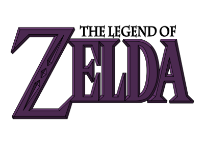

#Zelda Rumors of the Sheikah

This package contains the data files of the quest **Zelda: Rumors of the Sheikah**.
This quest is a free, open-source game that works with Solarus,
an open-source Zelda-like 2D game engine.
To play this game, you need Solarus. The compiled engine is included for Windows.

The game is currently in Version 0.1 Alpha

To run:
  Windows: execute "solarus.exe"
  Linux: download executable or compile source available at http://www.solarus-games.org (see compile instruction below)
  Mac: download executable or compile source available at http://www.solarus-games.org

To play: Default button mapping:
  "X" to use/assign left grey circle item and "V" to use/assign right grey circle item.
  "C" for green circle (sword or skip in dialogs).
  "Space" for blue circle (action or back in dialogs).
  "D" for Pause menu (or to exit pause). Left or right arrows to scroll between items and submenus.
  Buttons can be remapped (to other keys or joypad buttons) from within the Options submenu.
  Control key allows you to pan the camera slightly.
